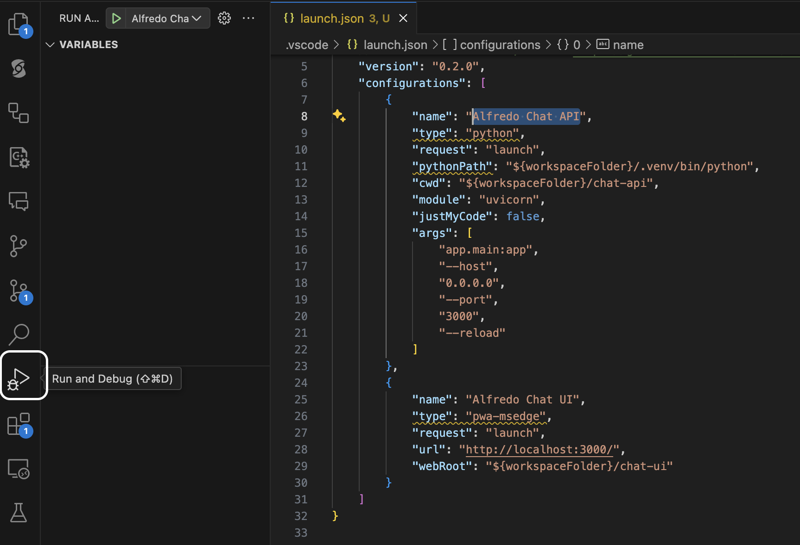
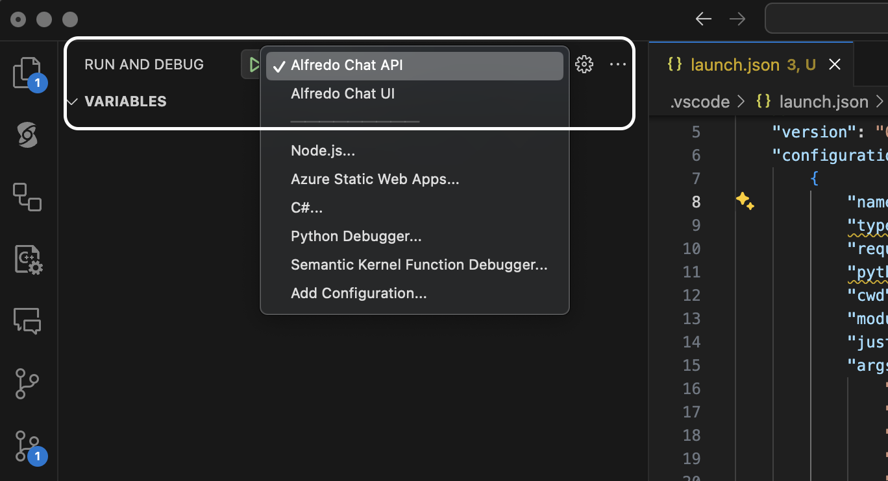

# Langchain Agent for Guardrails lab 

A simple implementation of a Langchain Tools Agent using Azure OpenAI. 

## Dependencies 

1. Azure OpenAI Resource. 

2. Backend [Restaurant API](../restaurant-api/README.md) which the agent will make calls to.
   - build and run with Docker from the (`make backend-build` following by `make backend-run` from the repository root)

3. Python (versions 3.10-3.12.3), and Poetry.
   - Use pyenv for different Python versions: https://github.com/pyenv/pyenv
   - Pipx is recommended for installing Poetry: https://pipx.pypa.io/stable/installation/ 
   - Installing and using Poetry: https://python-poetry.org/docs/
   
   <br>

## Installation & configuration 

Please see the [environment setup](../README.md#environment-setup) for options on installation & configuration. 

<br>

## Running 

Running the FastAPI application locally: 

```bash 
make chat-serve 
```

You should then be able to view the Swagger UI on http://localhost:3000/docs 


## Debug API with Visual Studio Code

In case you need to debug Chat API, there is debugger configuration `Alfredo Chat API` for VSCode. It uses repository level `.env` file and running with it.

To debug;

1. Go to run & debug pane in VSCode


2. Choose `Alfredo Chat API` on the top and and click run


3. Once application startup complete, add breakpoint and debug.

## References: 

- The Azure OpenAI API Versioning:  https://learn.microsoft.com/en-us/azure/ai-services/openai/api-version-deprecation.  Note that some functionality is only available on more recent versions.
