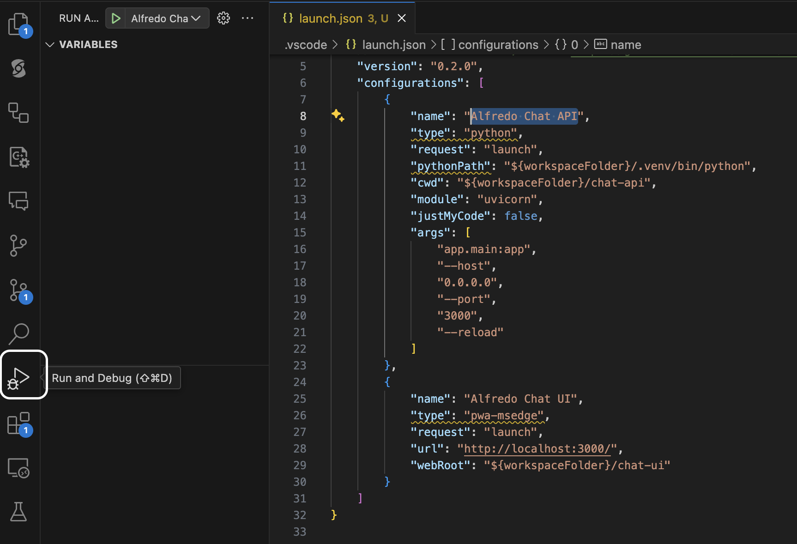
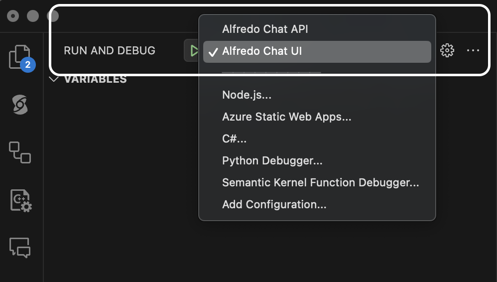

# Guardrails Chat UI

Welcome to the Guardrails Chat UI repository. This UI provides an easy and intuitive way to interact with existing AI models and the Chat API. Built with **React**, **TypeScript**, and **Vite**, it leverages **FluentUI** :heart: for a polished and consistent user experience.

## Prerequisites

Ensure you have the following installed on your local machine:

- [Node.js](https://nodejs.org/) (v14 or higher)
- [npm](https://www.npmjs.com/) or [yarn](https://yarnpkg.com/)
- [Docker](https://www.docker.com/) (optional, for Docker setup)
- [Make](https://www.gnu.org/software/make/) (optional, for using `make` commands)

## Getting Started

### Running Locally

To run the project locally, update the `.env.sample` file in `chat-ui` with the respective values and save it as `.env` in the `chat-ui` folder.

Example content for `.env`:

```bash
# This URL is the default Chat API URL. Unless you deploy on a different port, this value should suffice.
VITE_CHAT_API="http://127.0.0.1:3000"
```

To run following commands, you should be in `chat-ui` folder. To do that;

```bash
# Navigate from root folder to /chat-ui to run following make commands
cd chat-ui
```

### Option 1: Running Without Docker

#### Using npm

```bash
# Install dependencies
npm install

# Start the development server
npm run dev
```

#### Using Make

```bash
make ui-install
make ui-serve
```

### Option 2: Running With Docker

#### Easy Setup

```bash
make ui-run
```

#### Building a New Docker Image

To build a new Docker image:

```bash
make ui-build
```

#### Cleaning Docker Images

To clean up Docker images:

```bash
make ui-clean
```

### Debug API with Visual Studio Code

In case you need to debug Chat API, there is debugger configuration `Alfredo Chat API` for VSCode. It uses repository level `.env` folder and running with it.

To debug;

1. In the `chat-ui` folder, run the application `npm run dev`

2. Once UI is ready, go to run & debug pane in VSCode


3. Choose `Alfredo Chat UI` on the top and and click run


4. Once browser is opened, add breakpoint and debug.

## Nginx Configuration

The project includes an Nginx configuration file used for the Docker setup. This configuration ensures that the application runs smoothly within a Docker container with optimized settings.

## FluentUI

This project utilizes FluentUI for its components. FluentUI provides a robust and flexible set of components to build consistent and accessible user interfaces. For more information about FluentUI, please visit the [FluentUI documentation](https://developer.microsoft.com/en-us/fluentui#/get-started/web).

---

Thank you for using Guardrails Chat UI. If you encounter any issues or have any questions, please refer to the documentation or open an issue in the repository.
