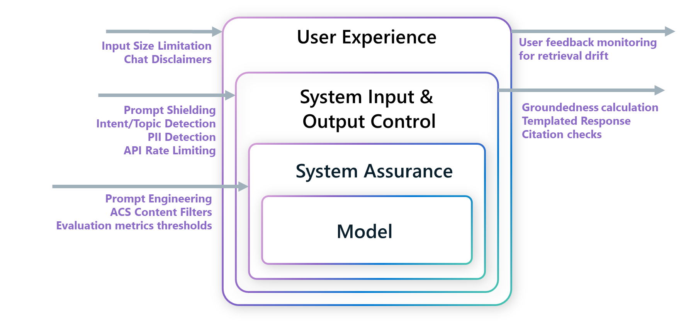
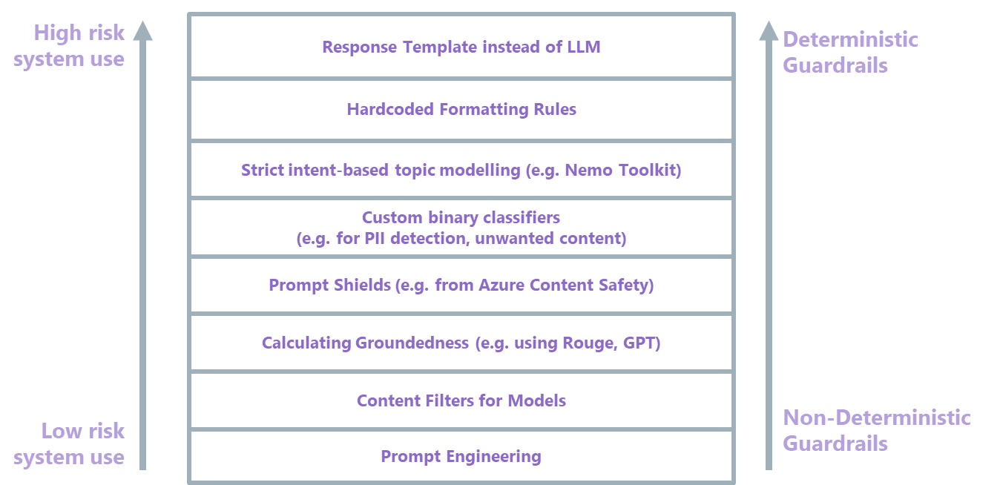
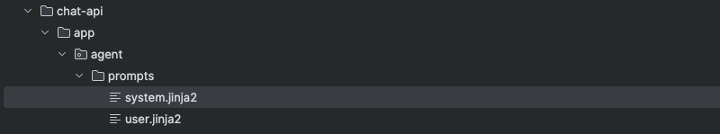
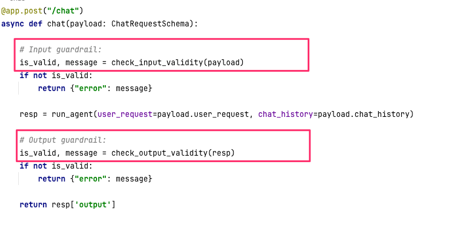
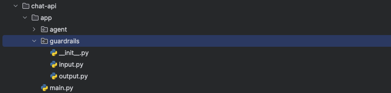

# 03-Mitigate

In this stage, you can start experimenting with different implementations of guardrails. For the risk(s) that you prioritized, you can decide to implement guardrail(s) at any layer of the system.

## 3.1 Mapping Risks to Guardrails

As part of the table you created in [Step 1.2 and 1.3](../01-Identify/README.md/#12-categorize-risks), you also identified at which `System Layer(s)` the risks are present, which gives additional insight as to where the *guardrails* could be implemented. This is not a 1:1 risk-to-guardrail mapping exercise: one risk could have multiple guardrails at various layers, and one guardrail could contribute to mitigating multiple risks.

In the image below you can see an example of mapping different guardrails implemented at different system layers:



The `Impact` level in our risk prioritization table gives us a hint on how strict the mitigation activities should be, for example, high impact risks or highly sensitive uses of the system should aim for deterministic and the more consistent types of non-deterministic guardrails, such as templated responses.

The image below shows a visualization of low versus high risk system uses and corresponding types of guardrails, with the goal of highlighting that since an AI system has many intended, unsupported and mis-uses with the associated risks, there will also be a full stack and often broad combination of guardrails required to cover them all.

**Note**: the order of the guardrails depicted in this image in terms of determinism is empirical and should only be considered as an example. Every use case is different and therefore guardrails will perform differently.



In the table below you can find **examples** of risks which are mapped to guardrails. Each guardrail has certain properties as defined in the [Identify stage](../01-Identify/README.md).

| Risk                         | Guardrail example                                                                                                                                                                                                                                                                                                                                                                                                                                | Guardrail type    | System Layer                                | Available Technologies                                                          |
| ---------------------------- | ------------------------------------------------------------------------------------------------------------------------------------------------------------------------------------------------------------------------------------------------------------------------------------------------------------------------------------------------------------------------------------------------------------------------------------------------ | ----------------- | ------------------------------------------- | ------------------------------------------------------------------------------- |
| Hallucination                | Retrieval Scores meet threshold X before system release                                                                                                                                                                                                                                                                                                                                                                                          | Deterministic     | System Assurance                            | Prompt Flow Evaluation Flows, Evaluation in LangChain etc                       |
|                              | Generation LLM-based metrics (for example, grounded-ness, relevance, coherence) meet threshold X before model Release                                                                                                                                                                                                                                                                                                                            | Non-Deterministic | System Assurance                            | Prompt Flow Evaluation Flows, Evaluation in LangChain etc.                      |
|                              | Realtime grounded-ness calculation                                                                                                                                                                                                                                                                                                                                                                                                               | Non-Deterministic | System Output Control                       | AI Content Safety Grounded-ness API, ROUGE-scores for overlap                   |
|                              | Templated Responses                                                                                                                                                                                                                                                                                                                                                                                                                              | Deterministic     | System Output Control                       | Use standard templated response for highly sensitive intents                    |
| Retrieval Drift              | Average user feedback scores over period X are above threshold X                                                                                                                                                                                                                                                                                                                                                                                 | Deterministic     | User Experience                             | Observability of User Feedback, Log Analytics, OpenTelemetry                    |
| Generating non-cited Content | Hardcoded rules to check output format                                                                                                                                                                                                                                                                                                                                                                                                           | Deterministic     | System Output Control                       | Custom hardcoded functions                                                      |
| Storing PII Data             | Use Disclaimers in Chat                                                                                                                                                                                                                                                                                                                                                                                                                          | Deterministic     | User Experience                             | Front-end development                                                           |
|                              | Check for PII in Input and Response using 1st party or open source models                                                                                                                                                                                                                                                                                                                                                                        | Non-Deterministic | System Input Control, System Output Control | Azure AI Services PII Detection, open source PII models                         |
| Generating Harmful Content   | Careful prompt engineering using [Sample AI Safety System Messages](https://learn.microsoft.com/en-us/azure/ai-services/openai/concepts/system-message#define-additional-safety-and-behavioral-guardrails), tested against diverse and representative evaluation datasets | Non-Deterministic | System Assurance                            | Prompt Engineering                                                              |
|                              | Blocking harmful requests through built-in LLM behavior from certain models like Azure OpenAI                                                                                                                                                                                                                                                                                                                                                    | Non-Deterministic | System Input Control, System Output Control | Azure OpenAI Studio (Content Filtering), Azure Content Safety (Text Moderation) |
| Generating Off-Topic Content | Instructing model to only respond to allowed topics                                                                                                                                                                                                                                                                                                                                                                                              | Non-Deterministic | System Assurance                            | Prompt Engineering                                                              |
|                              | Checking input intent to ensure that model only responds to allowed topics                                                                                                                                                                                                                                                                                                                                                                       | Non-Deterministic | System Input Control                        | Azure OpenAI Studio Block Lists, NeMo Toolkit, Guardrails AI                    |
| Prompt Injection             | Checking input intent for any jail breaking attempts                                                                                                                                                                                                                                                                                                                                                                                             | Non-Deterministic | System Input Control                        | Azure Content Safety Prompt Shields                                             |
|                              | Limiting maximum text size for input query and chat history                                                                                                                                                                                                                                                                                                                                                                                      | Deterministic     | User Experience                             | Hardcoded rules                                                                 |
| Vision Prompt Injection      | Detailed system message instructing model not to respond to text in image                                                                                                                                                                                                                                                                                                                                                                        | Non-Deterministic | System Assurance                            | Prompt Engineering                                                              |
|                              | OCR detection of invisible prompts                                                                                                                                                                                                                                                                                                                                                                                                               | Non-Deterministic | System Input Control                        | Azure AI Services OCR, open-source OCR models                                   |
| Model Denial of Service      | Token Limitation, Chat History limitation                                                                                                                                                                                                                                                                                                                                                                                                        | Deterministic     | User Experience                             | Front-end development                                                           |
|                              | API rate limiting on user request                                                                                                                                                                                                                                                                                                                                                                                                                | Deterministic     | System Input Control                        | GenAI Gateway, API Management                                                   |
|                              | Resource monitoring with anomaly detection                                                                                                                                                                                                                                                                                                                                                                                                       | Non-Deterministic | System Assurance                            | Log Analytics    

### 3.2 Guardrail Technologies

Below is a list of technologies that could be used for guardrail implementation. Feel free to use other frameworks if desired.

| Technology                     | Description                                                                                                                                                                                    | Links                                                                                                                                                             | Related Risk                                                                           |
| ------------------------------ | ---------------------------------------------------------------------------------------------------------------------------------------------------------------------------------------------- | ----------------------------------------------------------------------------------------------------------------------------------------------------------------- | -------------------------------------------------------------------------------------- |
| **Azure Content Safety**       | 1st Party Service consisting of multiple APIs to detect harmful content in applications and services                                                                                           | [Documentation](https://learn.microsoft.com/en-us/azure/ai-services/content-safety/)                                                                              | Harmful or otherwise unwanted content input or output, Prompt Injection, Hallucination |
| - Text Moderation              | AI algorithms that can be consumed through the SDK for flagging objectionable text in the categories hate, self-harm, sexual and violent                                                       | [Documentation](https://learn.microsoft.com/en-us/azure/ai-services/content-safety/quickstart-text?tabs=visual-studio%2Clinux&pivots=programming-language-python) | Harmful Content                                                                        |
| - Image Moderation             | AI algorithms that can be consumed through the SDK for flagging objectionable images in the categories hate, self-harm, sexual, and violent                                                    | [Documentation](https://learn.microsoft.com/en-us/azure/ai-services/content-safety/quickstart-image?tabs=visual-studio%2Clinux&pivots=programming-language-rest)  | Harmful Content                                                                        |
| - Prompt Shields               | ACS feature to check your large language model (LLM) inputs for both User Prompt and Document attacks                                                                                          | [Documentation](https://learn.microsoft.com/en-us/azure/ai-services/content-safety/quickstart-jailbreak)                                                          | Prompt Injection                                                                       |
| - Grounded-ness Detection      | ACS feature to check whether the text responses of large language models (LLMs) are grounded in the source materials provided by the users                                                     | [Documentation](https://learn.microsoft.com/en-us/azure/ai-services/content-safety/quickstart-groundedness?tabs=curl)                                             | Hallucination                                                                          |
| - Protected Material Detection | ACS feature to identify and block known text content (for example, song lyrics, articles, recipes, selected web content) from being displayed in language model output (English content only). | [Documentation](https://learn.microsoft.com/en-us/azure/ai-services/content-safety/quickstart-protected-material)                                                 | Copyright Infringement                                                                 |
| - Block-lists                  | Block-lists let you add custom terms to the AI classifiers which are used to screen for specific terms or phrases that you want to flag in your content                                        | [Documentation](https://learn.microsoft.com/en-us/azure/ai-services/content-safety/how-to/use-blocklist?tabs=linux%2Cpython)                                      | Harmful or otherwise unwanted content input or output                                  |
| - Custom Categories            | Semantic text matching using embedding search with a lightweight classifier, Image matching with a lightweight object-tracking model and embedding search                                      | [Documentation](https://techcommunity.microsoft.com/t5/ai-azure-ai-services-blog/announcing-custom-categories-in-azure-ai-content-safety/ba-p/4147024)            | Sensitive, Harmful or otherwise unwanted content input or output                       |
| **Azure AI Studio**            | 1st Party Service where features from AI Safety features from Azure Content Safety and Azure OpenAI Studio are integrated seamlessly                                                           | [Documentation](https://ai.azure.com/)                                                                                                                            | Harmful Content, Hallucination                                                         |
| **Azure OpenAI Studio**        | 1st Party Service where content filters and block lists from ACS can be enforced on deployed OpenAI models                                                                                     | [Documentation](https://oai.azure.com/)                                                                                                                           | Harmful or otherwise unwanted content input or output                                  |
| - Content Filtering            | Content filtering system that works alongside Azure OpenAI models, filter levels can be adapted to support use case needs                                                                      | [Documentation](https://learn.microsoft.com/en-us/azure/ai-services/openai/concepts/content-filter?tabs=warning%2Cpython-new)                                     | Harmful or otherwise unwanted content input or output                                  |
| - Block Lists                  | Filter specific terms on top of default content filters.                                                                                                                                       | [Documentation](https://learn.microsoft.com/en-us/azure/ai-services/openai/how-to/use-blocklists)                                                                 | Harmful or otherwise unwanted content input or output                                  |
| **Guardrails AI**              | Guardrails is a Python framework that helps build reliable AI applications through input/output based guardrails and generation of structured data from LLMs                                   | [Documentation](https://github.com/guardrails-ai/guardrails)                                                                                                      | Any input/output related risk                                                          |
| **NeMo Guardrails Toolkit**    | NeMo Guardrails is an open-source toolkit for easily adding programmable guardrails to LLM-based conversational applications                                                                   | [Documentation](https://github.com/NVIDIA/NeMo-Guardrails)                                                                                                        | Off-Topic Content                                                                      |
| **LLamaGuard 2**               | LLamaGuard 2 is an Input-Output Safeguard ML Model which classifies safe and unsafe text based content                                                                                         | [Documentation](https://github.com/meta-llama/PurpleLlama/blob/main/Llama-Guard2/MODEL_CARD.md)                                                                   | Harmful Content                                                                        |

## 3.3 Implementing Guardrails for Alfredo the Agent

Below you can find examples for how to implement guardrails on the System Assurance and System Input and Output Control layers:

### 1. System Assurance

#### Prompt Engineering

Try improving the system prompt.



You may need to restart the FastAPI upon making changes to the prompt
template for the changes to take effect.

### 2. System Input & Output Control

The FastAPI has only one route in the `main.py` entry point.  There you see that
the API payload is first passed to an input guardrail function before passing to
the agent. The response from the agent is also passed to a separate output guardrail
function:



Both functions can be found in the `/chat-api/app/guardrails` directory: 



Pleae adapt and enhance the respective functions.  Each function should return a tuple with
the first boolean element indicating whether the guardrail has passed or not.

#### Input guardrail

A placeholder input guardrail function from `/chat-api/app/agent/guardrails/input.py`

```python
def check_input_validity(payload: ChatRequestSchema) -> tuple:
    """
    Validates the user input before it is processed by the agent.

    Args:
        payload (ChatRequestSchema): incoming chat request schema containing user input, chat history & optional user_id

    Returns:
        tuple: A tuple containing a boolean and a message.
               The boolean is True if the input is valid, False otherwise.
               The message provides details on why the input was invalid (if it is invalid).
    """
    # Example rule: Reject input if it's too short
    if len(payload.user_request.strip()) < 3:
        return False, "Input is too short. Please provide more detail."

    # If all checks pass
    return True, "Input is valid."
```

The `ChatRequestSchema` is defined at `/chat-api/app/agent/schemas.py` but is essentially: 

```json
{ 
  "user_request": "",
  "chat_history": [],
  "user_id": ""
}
```

<br>

#### Customize the Tools

It is also possible to constrain the use of Tools. For example, at the moment, using the current 
CustomerRetrievalTool ( from `/chat-api/app/agent/tools/customer.py`) it is possible to query 
the details of any customer: 

```python
def customer_retrieval_tool(lastname: str = None,
                  firstname: str = None,
                  email: str = None,
                  phone: str = None) -> Dict[str, Any]:
                  ....
```

But the tool could be adapted to use an authenticated user ID, to ensure that users can only ask about their own account and orders.

Implement the guardrails suggested in the [examples](./examples/) folder.

## 3.4 Measure and Refine

After you've implemented a guardrail, run the evaluations again with the [evaluate-agent](../02-Measure/notebooks/evaluate-agent-api.ipynb) and [calculate-metrics](../02-Measure/notebooks/calculate-metrics.ipynb) notebooks to see how the agent performs after these changes. Keep iterating between code implementations and evaluation until the metrics are improved.

## Congrats, you finished the **Mitigate** stage!

Now you can go to the next stage, to make a plan for monitoring --> [04-Monitor](../04-Monitor/README.md)