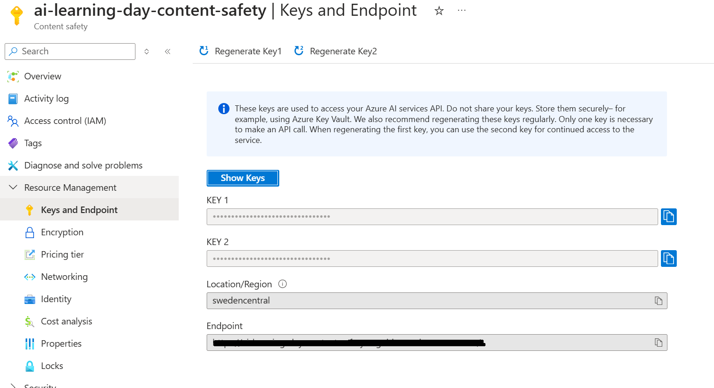

# Guardrail example: Groundedness check

One way of mitigating hallucination by an agent, is to check for each agent's response if it is grounded in the content. One way of doing this is by using Azure Content Safety's Groundedness API.

## Create an Azure Content Safety instance

In the [Azure Portal](https://portal.azure.com), type **Azure Content Safety** in the search bar and create a new instance if needed.

Please use **East US** as the region for deployment. As of today when writing this lab content, this is the only region which has all (preview) features available. You can review the [regional availability for ACS here](https://learn.microsoft.com/en-us/azure/ai-services/content-safety/overview#region-availability).


## Copy the Content Safety Endpoint and Subscription Key

After the new ACS instance is deployed, go to the **Resource Management** tab and then **Keys and Endpoint**.

Copy the value of the **Key** and **Endpoint**.



## Update `.env` inside `chat-api`

In your local development setup, navigate to the `chat-api/.env` file

Add the following variables to the `.env` file:

> Note: you should remove the `https://` part of your ACS Endpoint:

```env
ACS_API_BASE = "<name of your acs instance>.cognitiveservices.azure.com"
ACS_KEY = "<your azure content safety subscription key>"
```

## Implement output guardrail

In your local development setup, navigate to the `chat-api/app/guardrails/output.py` file.

Copy paste the code below into the `output.py` file. This code adds the functionality of checking in the output whether any specific `day` was mentioned, and then goes to check the menu for that given day using the `menu-api`. This retrieved menu is then passed onto the **Groundedness API** together with the agent's response, to see how grounded the agent's response was in the content that it has retrieved. If it turns out that the response is considered *ungrounded*, the agent will return a templated response with the menu as-is.

> Note: in this particular case for Alfredo the Agent, a better way of mitigating menu hallucination would be to **always** pass the retrieved menu from the API directly into the response, and not let the LLM handle the formatting. Therefore, the code sample below where we do an additional call to the menu API is considered an after-thought solution purely to demonstrate running such checks as a guardrail. A better design from the start where the **retrieval** is handled deterministically + a more lightweight guardrail for checking LLM response based on the retrieved data is preferred.

```python
from typing import List, Dict, Any
import os
import http.client
import json

restaurant_api_base = os.getenv("RESTAURANT_API_BASE").replace("http://", "")
acs_api_base = os.getenv("ACS_API_BASE")
acs_key = os.getenv("ACS_KEY")

def format_menu(menu_api_result: list, day: str) -> str:
    # Convert the day to the correct key format
    day_key = f"available_{day.lower()}"

    # Convert JSON to text format
    output = ""
    categories = {}

    # Organize data by category and filter by day
    for item in menu_api_result:
        if item.get(day_key):
            category = item['category']
            if category not in categories:
                categories[category] = []
            categories[category].append(item)

    # Format the text output
    for category, items in categories.items():
        output += f"      {category.capitalize()}\n\n"
        for idx, item in enumerate(items, start=1):
            output += f"      {idx}. {item['name']} - ${item['price']} - {item['ingredients']} - {item['labels']}\n"
        output += "\n"

    return output

def format_acs_input(agent_response:dict, formatted_menu:str) -> dict:
    payload = json.dumps({
    "domain": "Generic",
    "task": "QnA",
    "qna": {
        "query": agent_response['user_request']
    },
    "text": agent_response['output'],
    "groundingSources": [
        formatted_menu
    ],
    "reasoning": False
    })
    headers = {
    'Ocp-Apim-Subscription-Key': acs_key,
    'Content-Type': 'application/json'
    }
    return payload, headers

def check_output_validity(agent_response: dict) -> tuple:
    """
    Validates the agent's response contained before it is sent to the user.

    Args:
        agent_response (dict): The response dictionary from the agent. Example:
                               {
                                'user_request': <user_request>,
                                'chat_history': [{'role': 'user', 'content': 'what is it you want?'}],
                                'output': 'response-from-the-agent-as-a-result'
                                }

    Returns:
        tuple: A tuple containing a boolean and a message.
               The boolean is True if the response ('output' key) is valid, False otherwise.
               The message provides details on why the response was invalid (if it is).
    """
    agent_output = agent_response['output']
    ungrounded_detected = False
    
    for day in ['monday', 'tuesday', 'wednesday', 'thursday', 'friday', 'saturday', 'sunday']:
        if day in agent_output.lower():
            print(f"Output Guardrail: Checking the menu for {day}")
            conn = http.client.HTTPConnection(restaurant_api_base)
            payload = json.dumps({'day': day})
            conn.request("GET", "/api/menu-items", payload)
            res = conn.getresponse()
            data = res.read()
            menu = json.loads(data.decode("utf-8"))
            formatted_menu = format_menu(menu, day)

            payload, headers = format_acs_input(agent_response, formatted_menu)
            conn = http.client.HTTPSConnection(acs_api_base)
            conn.request("POST", "/contentsafety/text:detectGroundedness?api-version=2024-02-15-preview", payload, headers)
            res = conn.getresponse()
            data = res.read()
            data_dict = json.loads(data.decode("utf-8"))
            ungrounded_detected = data_dict.get("ungroundedDetected")

    if ungrounded_detected:
        output = False, f"Apologies, I'm still not perfect so sometimes I make mistakes, here's the full menu for the day you requested:   {formatted_menu}"
    else:
        output = True, agent_response
    return output

```