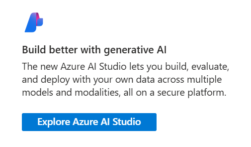
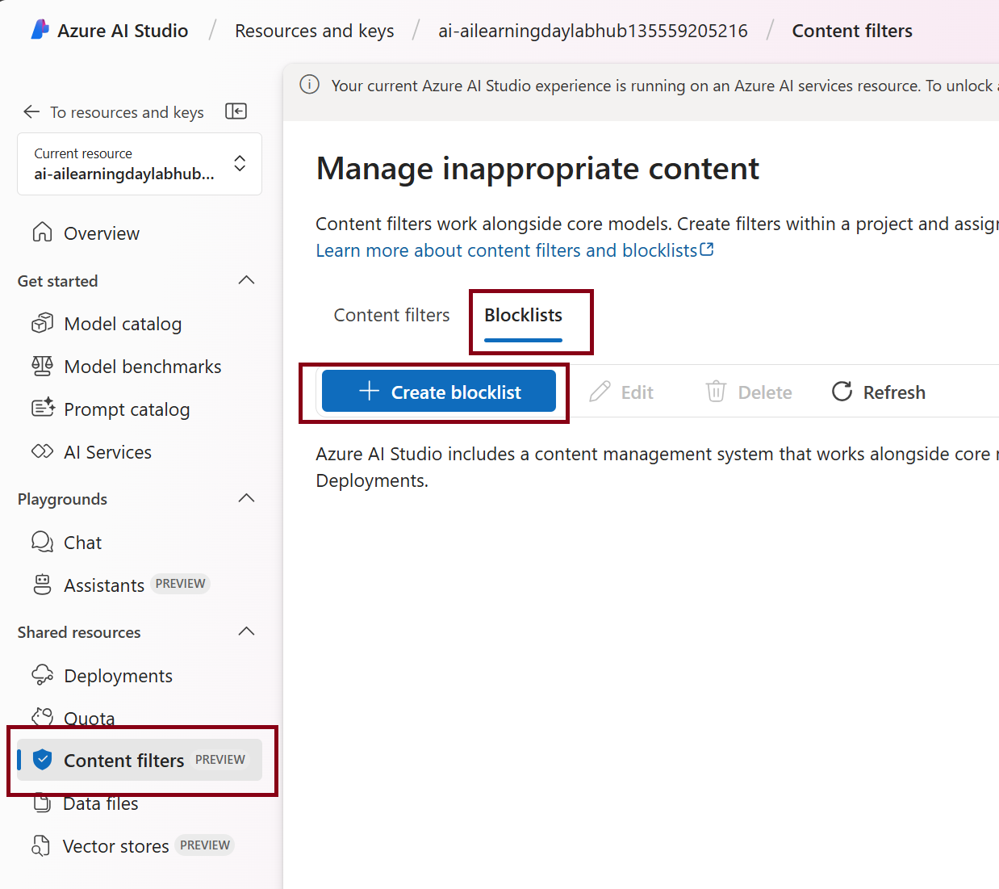
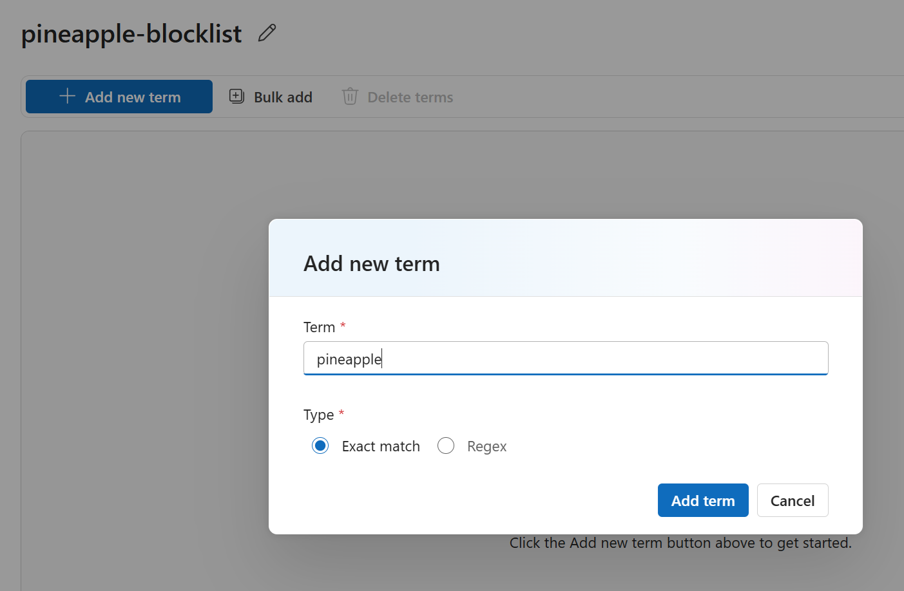
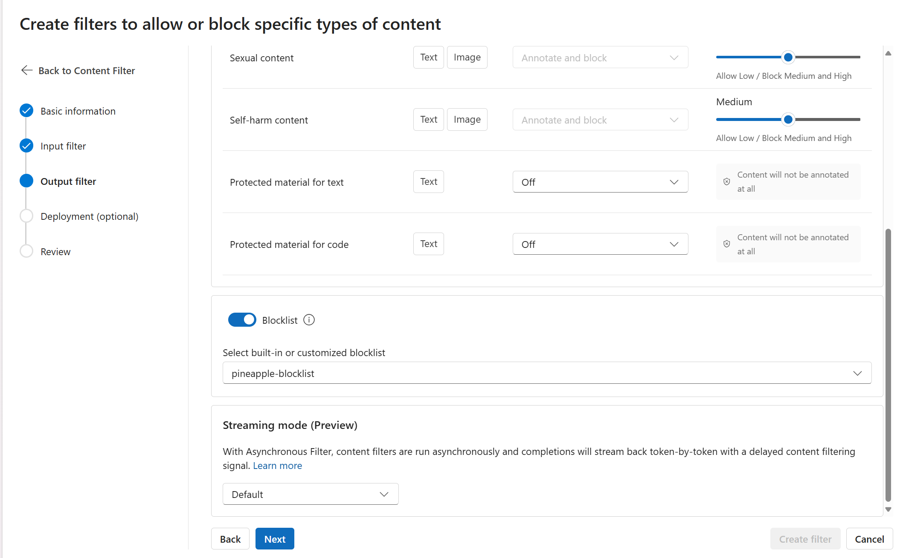

# Guardrail example: Block harmful content

One way of mitigating harmful content provided by an Azure OpenAI LLM Model, is by setting strict content block levels on the model deployment itself and more specifically, by providing custom examples (like `pineapple`) which are blocked by the model as well. This functionality is very helpful when dealing with custom use cases, since particular words can be completely acceptable in one scenario, but can be considered harmful or otherwise unwanted in another.

## Review your Azure OpenAI Deployment

Navigate to your Azure OpenAI service in the [Azure Portal](https://portal.azure.com). In the **Overview** page, select the option to **Explore Azure AI Studio**: 

## Add a Blocklist

In AI Studio, navigate to the **Content Filters** tab on the left side.

At the top, select the **Blocklists** tab and select **Create blocklist**.

Give your new blocklist a descriptive name, e.g. `pineapple-blocklist` and press **Create blocklist**.

After that, select the blocklist you just created, and press **Add a new term**.

Now you can add `pineapple` as an exact match term. Feel free to add also alternative terms like `hawaii` if you want to.

## Add a Content Filter

Navigate back to the **Content Filters** tab on the left.

Now, select **Content Filters** at the top instead of blocklists.

Select **Create content filter** and provide a new name for it.

Now explore the different steps of creating your content filter: as you can see there is a dedicated step for defining the **input** and **output filters**, so you can decide to block the use of `pineapple` both on the model input and output. You can also modify the default levels of content filtering against harmful content in the categories hate, violence, sexual content and self-harm. Additionally, there are options available to annotate and/or block protected material for text and code.

Scroll towards the bottom of the **input** filter and toggle the **Blocklist** option.

Select your previously created blocklist from the dropdown:

In the **deployment** step, select the model deployment for which you would like to enable this filter (most likely the `gpt-4` deployment you created for this lab).

Press Next and then **Create Filter**.

## Test your deployment

Try it our for yourself by asking for some delicious pineapple!
